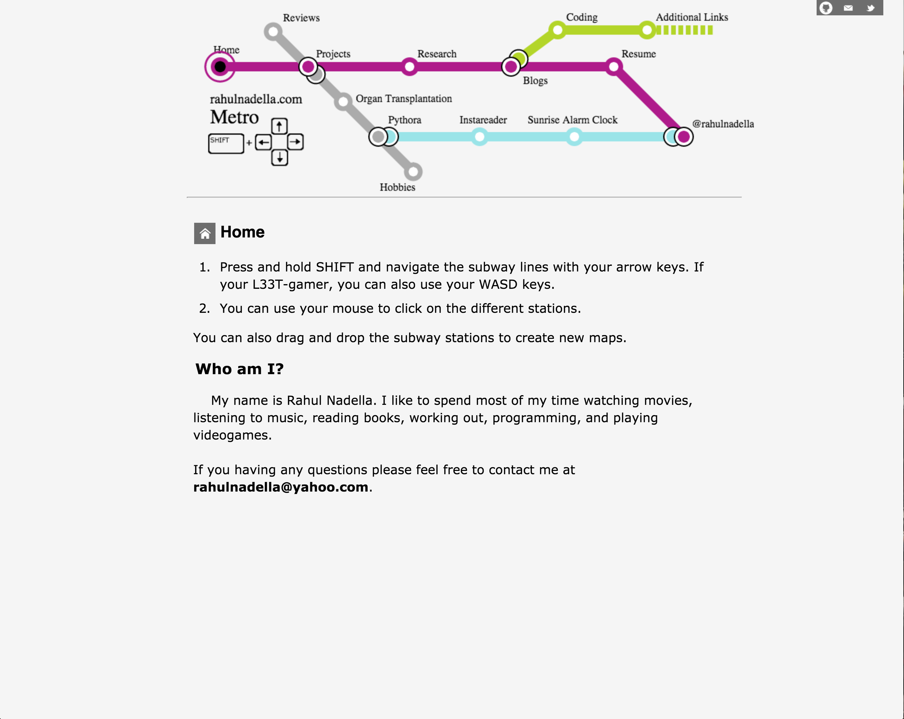
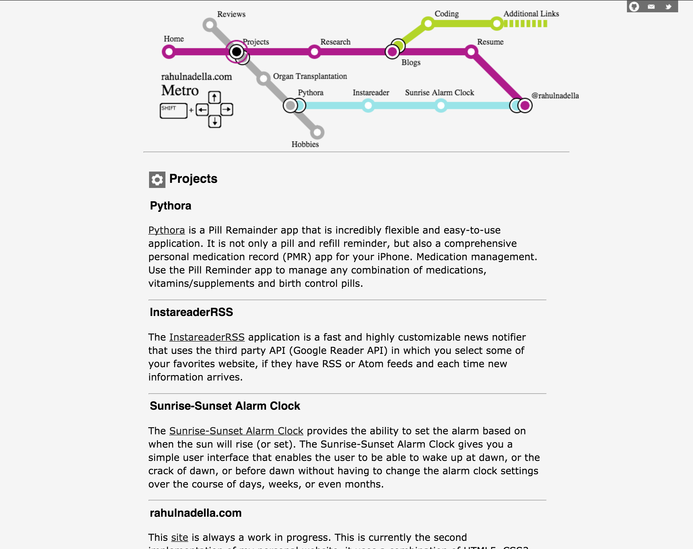
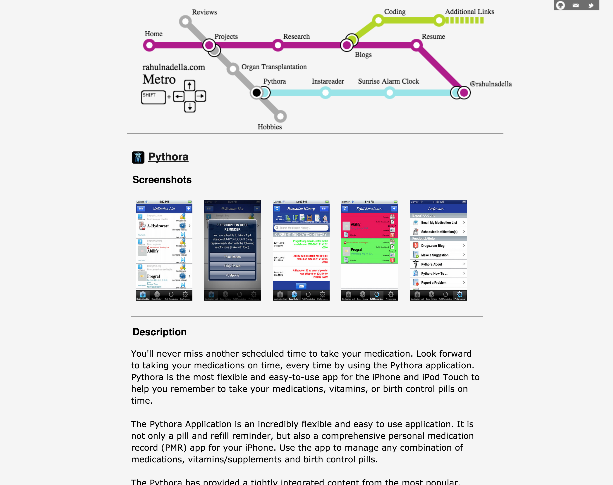
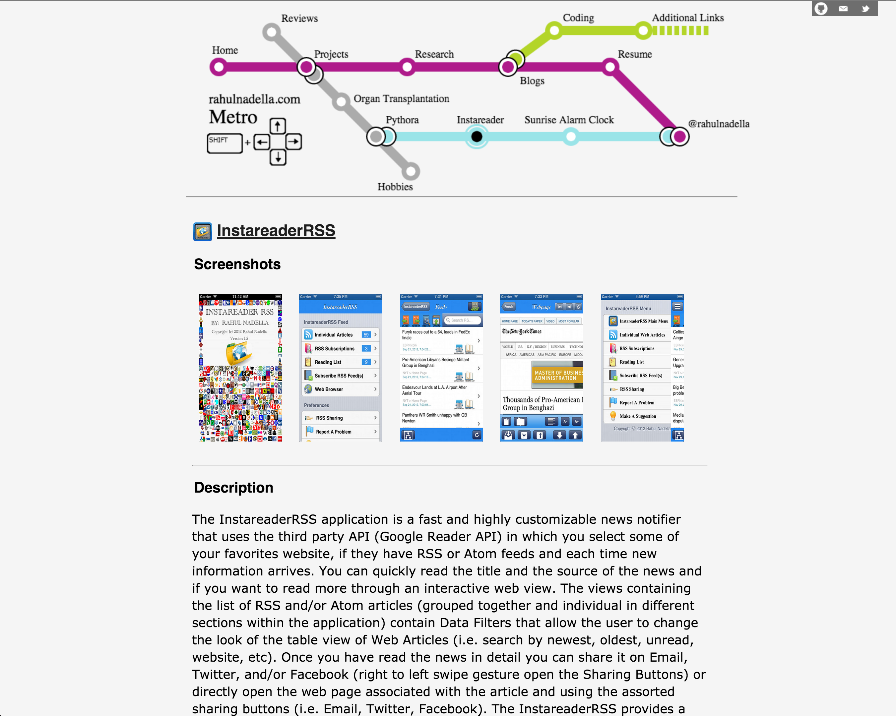
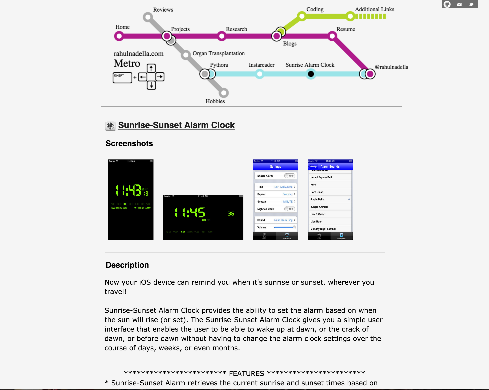

#rahulnadella.com Version 1

This project contains an implementation of my website (http://rahulnadella.com) over the past two years.

Main Screen (upon loading to http://rahulnadella.com)

        

Projects Screen 

        

Pythora App (iOS Application -> https://itunes.apple.com/us/app/pythora/id535251887?mt=8)

        

Instareader App (iOS Application -> https://itunes.apple.com/us/app/instareaderrss/id530271901?mt=8)

        

Sunrise-Sunset Alarm Clock (iOS Application - > https://itunes.apple.com/us/app/sunrise-sunset-alarm-clock/id574200416?mt=8)

        

